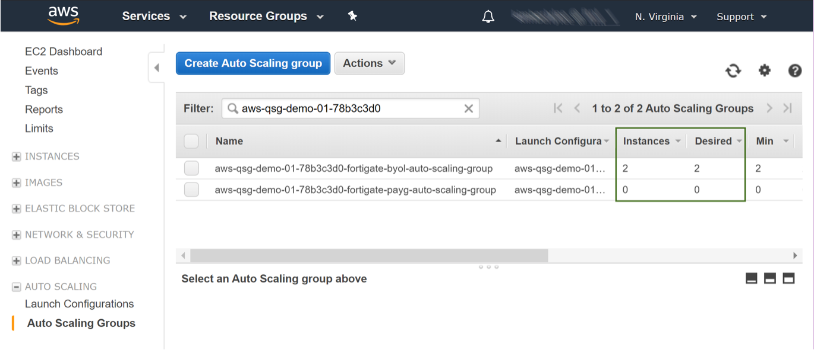
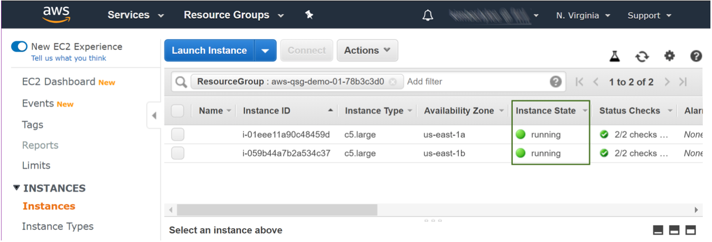
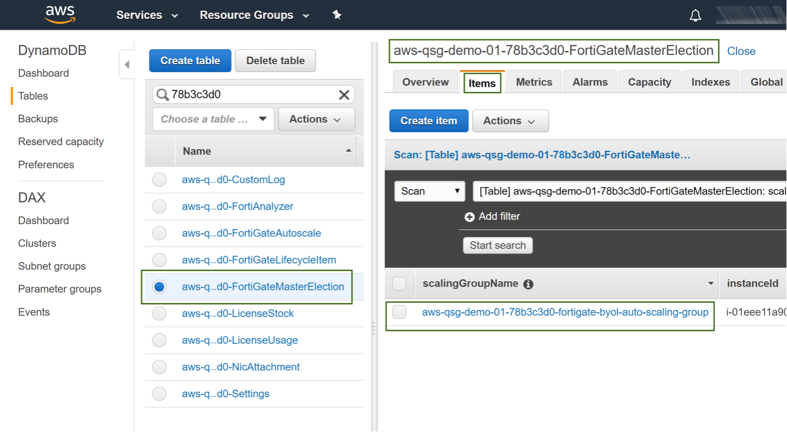
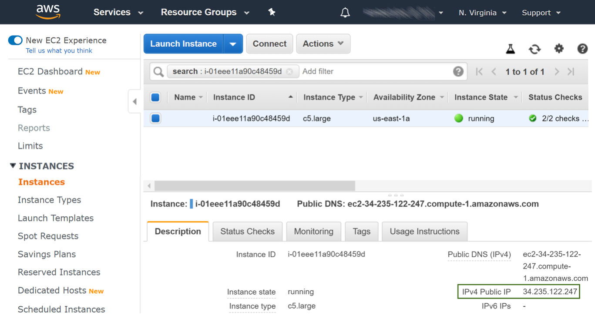
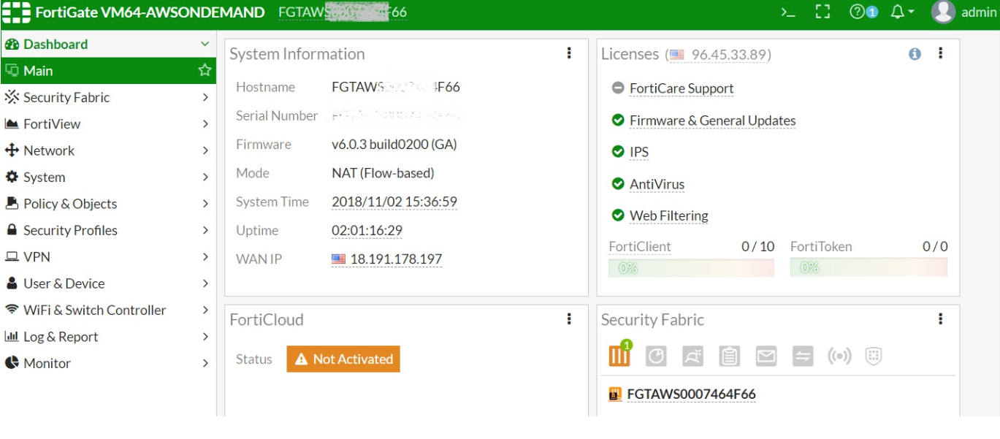

// Add steps as necessary for accessing the software, post-configuration, and testing. Don’t include full usage instructions for your software, but add links to your product documentation for that information.
//Should any sections not be applicable, remove them

== Test the deployment

Fortinet FortiGate Auto Scaling creates two Auto Scaling groups with an elected master instance.

.	Confirm that the Auto Scaling groups were created after completion of the CloudFormation stack.
The name of each group will start with the prefix you specified in Resource tag prefix. Confirm that the number in the Instances column is equal to or greater than the Desired capacity you specified.
+
:xrefstyle: short
[#test_deployment_1]
.Test the deployment
[link=images/test_deployment_1.png]

+ 
.	Confirm that all FortiGate instances are running.
+
:xrefstyle: short
[#test_deployment_2]
.Test the deployment
[link=images/test_deployment_2.png]

+
.	Confirm that a primary instance was elected.
Look up the DynamoDB table <ResourceTagPrefix>-FortiGateMasterElection. Select the Items tab and open the master record (the only item listed). A master has been elected when the voteState is done.
 +
:xrefstyle: short
[#test_deployment_3]
.Test the deployment
[link=images/test_deployment_3.png]

TIP:     Make note of the instanceID as you will need it to connect to the master FortiGate

== Post deployment steps
// If Post-deployment steps are required, add them here. If not, remove the heading

=== Connect to the Primary FortiGate instance

To connect to the master FortiGate instance you will need a login URL, a username, and a password.

.	Construct the login URL in this way: https://<IPAddress>:<Port>/.
Port refers to the Admin port specified during FortiGate configuration.
IPAddress refers to the IPv4 Public IP of the FortiGate and is listed on the Description tab for the instance. In th EC2 Management console, locate the instance using the instanceID of the master instance.
+
:xrefstyle: short
[#post_deployment_1]
.Post deployment steps
[link=images/post_deployment_1.png]

+ 
.	Open an HTTPS session and go to the login URL.
+
NOTE: Your browser will display a certificate error message. This is normal because the default FortiGate certificate is self-signed and not recognized by browsers. Proceed past this error. At a later time, you can upload a publicly signed certificate to avoid this error.
+
.	Log in to the FortiGate with the username admin and the default password of the instanceID of the master instance.
+
NOTE: As the master FortiGate propagates the password to all secondary FortiGate instances, this is the initial password for all FortiGate instances. You will need this initial password if failover occurs prior to the password being changed, as the newly elected master FortiGate will still have the initial password of the previous master.
+
.	You will be prompted to change the password at the first-time login.
+
NOTE: You should only change the password on the master FortiGate instance. The master FortiGate instance will propagate the password to all slave FortiGates. Any password changed on a slave FortiGate will be overwritten.
+
.	You will now see the FortiGate dashboard. The information displayed in the license widget of the dashboard depends on your license type.
+
:xrefstyle: short
[#post_deployment_2]
.Post deployment steps
[link=images/post_deployment_2.png]

== Other useful information
//Provide any other information of interest to users, especially focusing on areas where AWS or cloud usage differs from on-premises usage.

=== Fortinet FortiGate Auto Scaling on AWS features 

==== Major components

*	*The BYOL Auto Scaling group* contains 0 to many FortiGates of the BYOL licensing model and will dynamically scale-out or scale-in based on the scaling metrics specified by the parameters Scale-out threshold and Scale-in threshold. For each instance you must provide a valid license purchased from FortiCare.

NOTE: For BYOL-only and hybrid licensing deployments, the Minimum group size (FgtAsgMinSizeByol) must be at least 2. These FortiGates are the main instances and are fixed and running 7x24. If it is set to 1 and the instance fails to work, the current FortiGate configuration will be lost.

*	*The On-demand Auto Scaling group* contains 0 to many FortiGates of the On-demand licensing model and will dynamically scale-out or scale-in based on the scaling metrics specified by the parameters Scale-out threshold and Scale-in threshold.

NOTE: For On-demand-only deployments, the Minimum group size (FgtAsgMinSizePayg) must be at least 2. These FortiGates are the main instances and are fixed and running 7x24. If it is set to 1 and the instance fails to work, the current FortiGate configuration will be lost.

*	*The assets/configset folder in the S3 bucket* contains files that are loaded as the initial configuration for a new FortiGate instance.
**	baseconfig is the base configuration. This file can be modified as needed to meet your network requirements. Placeholders such as {SYNC_INTERFACE} are explained in the Configset placeholders table below.
**	httproutingpolicy and httpsroutingpolicy are provided as part of the base configset - for a common use case - and specify the FortiGate firewall policy for VIPs for http routing and https routing respectively. This common use case includes a VIP on port 80 and a VIP on port 443 with a policy that points to an internal load balancer. The port numbers are configurable and can be changed during CFT deployment. Additional VIPs can be added here as needed.

NOTE: In FortiOS 6.2.3, any VIPs created on the master will not sync to the slave units. Any VIP you wish to add must be added as part of the base configuration.
If you set the Internal ELB options parameter to “do not need one”, then you must append your VIP configuration to baseconfig.
** *(Optional) The assets/fgt-asg-license folder in the S3 bucket* contains BYOL license files.

*	The tables in DynamoDB are required to store information such as health check monitoring, master election, state transitions, etc. These records should not be modified unless required for troubleshooting purposes.
*	The networking components include the network load balancers, the target group, and the VPC and subnets. You are expected to create your own client and server instances that you want protected by the FortiGate.

==== Configset placeholders

When the FortiGate requests the configuration from the FortiGate Auto Scaling Handler function, the placeholders in the table below will be replaced with actual values about the Auto Scaling group.

[cols="3",options="header",grid=rows,frame=topbot]
|===
|Placeholder  |Type | Description
|*{SYNC_INTERFACE}*
|Text
|The interface for FortiGates to synchronize information. +
Specify as port1, port2, port3, etc. +
All characters must be lowercase.
|*{CALLBACK_URL}*	
|URL	
|The endpoint URL to interact with the auto scaling handler script. +
Automatically generated during CloudFormation deployment.
|*{PSK_SECRET}*	
|Text	
|The Pre-Shared Key used in FortiOS. +
Specified during CloudFormation deployment.
|*{ADMIN_PORT}*	
|Number	
|A port number specified for admin login. +
A positive integer such as 443 etc. +
Specified during CloudFormation deployment.
|*{HEART_BEAT_INTERVAL}*	
|Number	
|The time interval (in seconds) that the FortiGate waits between sending heartbeat requests to the Autoscale handler function.
|===

==== Auto Scaling Handler environment variables

[cols="2",options="header",grid=rows,frame=topbot]
|===
|Variable name | Description
|*UNIQUE_ID*	
|Reserved, empty string.
|*CUSTOM_ID*	
|Reserved, empty string.
|*RESOURCE_TAG_PREFIX*	
|The value of the CFT parameter *Resource tag prefix* which is described in the table *Resource tagging configuration.*
|===

=== Additional Resources

*AWS resources*

*	https://aws.amazon.com/getting-started/[Getting Started Resource Center]
*	https://docs.aws.amazon.com/general/latest/gr/[AWS General Reference]
*	https://docs.aws.amazon.com/general/latest/gr/glos-chap.html[AWS Glossary]

*AWS services*

*	https://docs.aws.amazon.com/cloudformation/[AWS CloudFormation]
*	https://docs.aws.amazon.com/AWSEC2/latest/UserGuide/AmazonEBS.html[Amazon EBS]
*	https://docs.aws.amazon.com/ec2/[Amazon EC2]
*	https://docs.aws.amazon.com/iam/[IAM]
*	https://docs.aws.amazon.com/vpc/[Amazon VPC]

*Fortinet FortiGate Auto Scaling documentation*

*	https://docs.fortinet.com/document/fortigate/6.2.3/cookbook/[FortiGate FortiOS Cookbook]

*	https://docs.fortinet.com/vm/aws/fortigate/6.2/aws-cookbook/6.2.0/[FortiGate-VM for AWS]

*	https://www.fortinet.com/content/dam/fortinet/assets/data-sheets/FortiGate_VM.pdf[FortiGate-VM datasheet]

