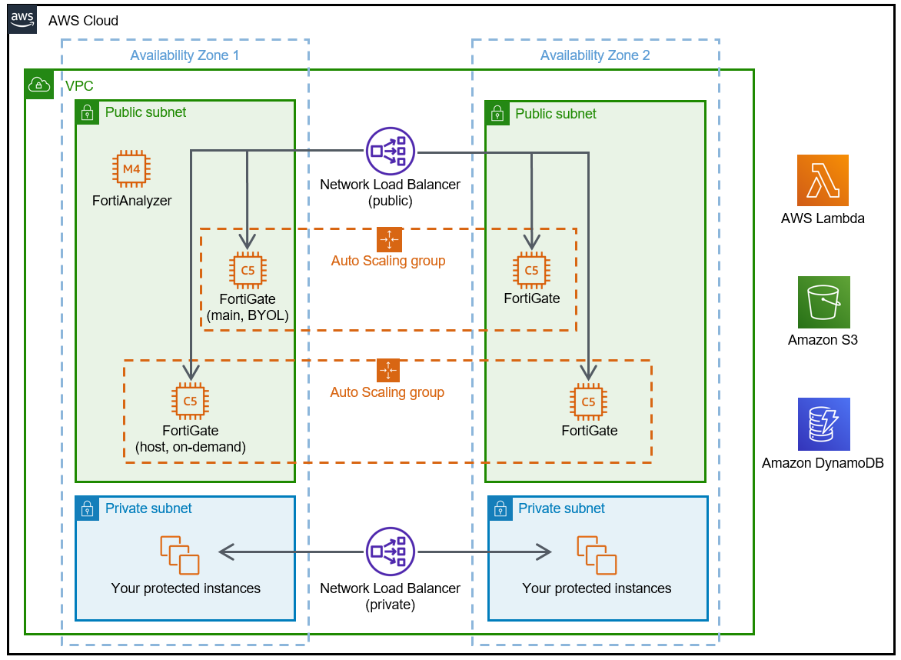

Deploying this Quick Start for a new virtual private cloud (VPC) with
default parameters builds the following {partner-product-name} environment in the
AWS Cloud.

:xrefstyle: short
[#architecture1]
.Quick Start architecture for _{partner-product-name}_ on AWS

As shown in <<architecture1>>, the Quick Start sets up the following:

* A highly available architecture that spans two Availability Zones.*

* A VPC configured with public and private subnets, according to AWS
best practices, to provide you with your own virtual network on AWS.*

* An internet gateway to provide access to the internet.*

* In the public subnets:

** A FortiAnalyzer instance, which consolidates logging and reporting for your FortiGate cluster.

** Within the FortiGate cluster, Amazon EC2 Auto Scaling groups of FortiGate instances that use Bring Your Own License model (BYOL) licenses or on-demand licenses. This cluster contains the following:

*** Two or more FortiGate instances, which complement AWS security groups (not shown). Security groups provide intrusion protection, web filtering, and threat detection to help protect your services from cyberattacks. Each instance also provides VPN access for authorized users.

*** A main FortiGate instance, which acts as a NAT gateway, allowing outbound internet access for resources in the private subnets.*

* A public Network Load Balancer that distributes inbound traffic across the FortiGate instances.

* (Optional) A private Network Load Balancer that distributes inbound traffic across the workload instances that you want to protect from outside access.

* AWS Lambda, which provides the core Amazon EC2 Auto Scaling functionality between FortiGate instances.

* Amazon Simple Storage Service (Amazon S3) to host artifacts for Lambda functions and logs.

* Amazon DynamoDB to store information about Amazon EC2 Auto Scaling condition states.

[.small]#*The template that deploys the Quick Start into an existing VPC skips the components marked by asterisks and prompts you for your existing VPC configuration.#