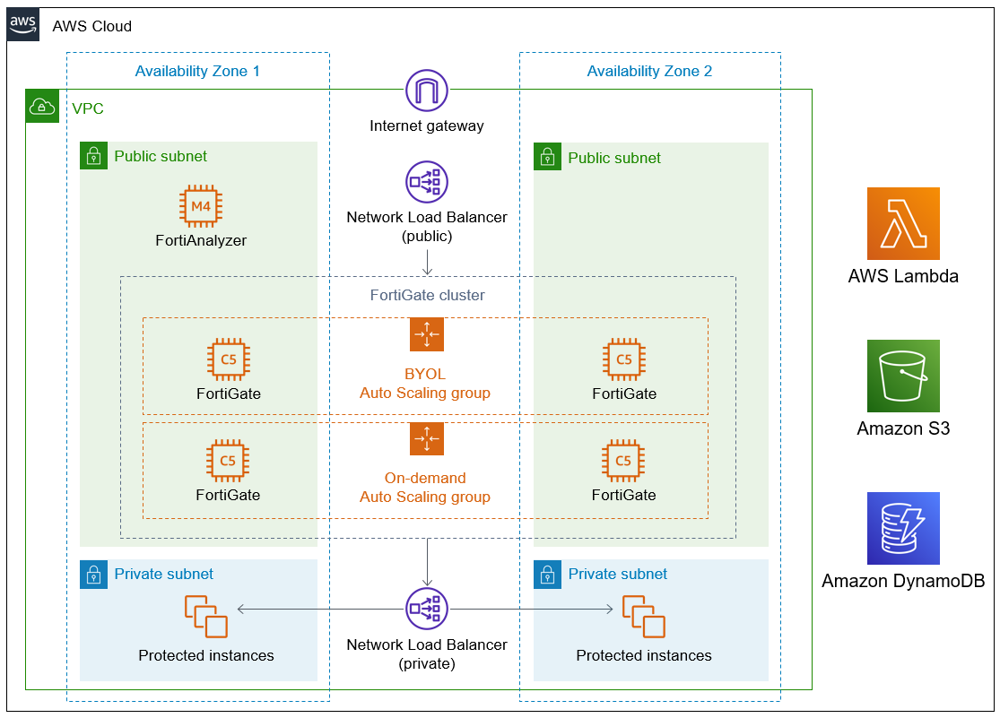

Deploying this Quick Start for a new virtual private cloud (VPC) with
default parameters builds the following {partner-product-name} environment in the
AWS Cloud.

:xrefstyle: short
[#architecture1]
.Quick Start architecture for _{partner-product-name}_ on AWS

As shown in <<architecture1>>, the Quick Start sets up the following:

* A highly available architecture that spans two Availability Zones.*

* A VPC configured with public and private subnets, according to AWS
best practices, to provide you with your own virtual network on AWS.*

* In the public subnets:

** A Network Load Balancer, which distributes inbound traffic across FortiGate instances.

** A FortiAnalyzer instance, which consolidates logging and reporting for your FortiGate cluster.

** An Amazon EC2 Auto Scaling group that contains a FortiGate main instance with a BYOL license.

** An Amazon EC2 Auto Scaling group that contains a FortiGate host with an on-demand license. This group complements security groups (not shown). This host provides intrusion protection, web filtering, and threat detection to help protect your services from cyberattacks. It also allows VPN access by authorized users.

* In the private subnets:

** (Optional) A Network Load Balancer that distributes inbound traffic across your protected instances.

* AWS Lambda, which provides the core Amazon EC2 Auto Scaling functionality between FortiGate instances.

* Amazon S3 to host artifacts for Lambda functions and logs.

* Amazon DynamoDB to store information about Amazon EC2 Auto Scaling condition states.

[.small]#*The template that deploys the Quick Start into an existing VPC skips the components marked by asterisks and prompts you for your existing VPC configuration.#